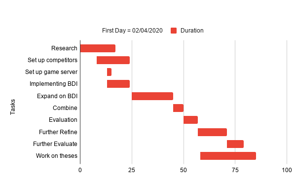

<!-- PROJECT SHIELDS -->
<!--
*** I'm using markdown "reference style" links for readability.
*** Reference links are enclosed in brackets [ ] instead of parentheses ( ).
*** See the bottom of this document for the declaration of the reference variables
*** for contributors-url, forks-url, etc. This is an optional, concise syntax you may use.
*** https://www.markdownguide.org/basic-syntax/#reference-style-links
-->

[![Contributors][contributors-shield]][contributors-url]
[![Issues][issues-shield]][issues-url]


<!-- PROJECT LOGO -->
<br />
<p align="center">
  <a href="https://github.com/DanielPerezJensen/mapc-uva">
    
  </a>

  <h3 align="center">mapc-uva</h3>

<!--   <p align="center">
    <br />
    <a href="https://github.com/github_username/repo"><strong>Explore the docs »</strong></a>
    <br />
    <br />
    <a href="https://github.com/github_username/repo">View Demo</a>
    ·
    <a href="https://github.com/github_username/repo/issues">Report Bug</a>
    ·
    <a href="https://github.com/github_username/repo/issues">Request Feature</a>
  </p> -->
</p>


<!-- TABLE OF CONTENTS -->
## Table of Contents

* [About the Project](#about-the-project)
  * [Built With](#built-with)
* [Getting Started](#getting-started)
  * [Installation](#installation)
* [Usage](#usage)
* [Roadmap](#roadmap)
* [Contributing](#contributing)
* [License](#license)
* [Contact](#contact)
* [Acknowledgements](#acknowledgements)


<!-- ABOUT THE PROJECT -->
## About The Project
This repository serves as the code hub for our entry into the [multi agent programming contest](https://multiagentcontest.org/). For this purpose we have created our own BDI module and communication protocol with the multi agent programming contest within Python. 


### Built With

* [Python3.6](https://www.python.org/)
* [D* Lite](localhost)

<!-- GETTING STARTED -->
## Getting Started


### Installation
pip install -r requirements


<!-- USAGE EXAMPLES -->
## Usage
To use the code according to our implementation within the [MAPC](https://multiagentcontest.org/) run `python3 main.py`.

The BDI-component as modelled in [BDIAgent.py](https://github.com/DanielPerezJensen/mapc-uva/blob/master/agents/helpers/BDIAgent.py) can be used independently. To use the BDI model separately create your agent class and have it be inherited like so:

```python
from BDIAgent import BDIAgent

class SampleAgent(BDI):
  ...
```

Within this `SampleAgent` there must be a `run`-function like so:

```python
class SampleAgent(BDI):
  def run():
      while True:
          new_intention = get_intention()
          self.add_intention(new_intention)
          action = self.execute_intention()
          # perform action
```

The `get_intention()`-function can be for example a series of if-statements that decides what intention the agent should perform next, but can be whatever you like as long as it returns an intention. Example:

```python
class SampleAgent(BDI):
    def run():
        while True:
            ...
  
  def get_intention():
      if True:
          return plan1
      else:
          return plan2
```

The intention is then added to the intention queue through the BDI module. Next the intention is executed and an action is returned, this action should be a primitive function which the agent can directly execute (such as `move`). The `new_intention` is retrieved from what we call a plan within the `SampleAgent`-class. A plan can be created like this:

```python
class SampleAgent(BDI):
    def run():
        ...
      
    def plan1():
        # do some logic
        intentions = [self.move, self.move]
        args = [((2, 3),), ((1, 2),)]
        contexts = [tuple(), tuple()]
        descriptions = ["moveTo(2,3)", "moveTo(1,2)"]
        primitives = [True, True]

        return intentions, args, contexts, descriptions, primitives
```

A plan must always contain 5 lists, a list of `intentions` (which we model as a bound method), a list of `arguments` which are the arguments for the respective bound functions, `contexts` which are currently not used for anything but can be seen as what your agent should believe before executing the respective intention and `primitives` which is a list of Booleans that tell the model if a given intention is primitive or not. An intention is primitive if it can be directly executed by an agent, and it is non-primitive in case you want to add a sub-plan which the agent cannot directly perform. Example:

```python
class SampleAgent(BDI):
  def run():
      while True:
          new_intention = get_intention()
          self.add_intention(new_intention)
          action = self.execute_intention()
          # perform action

    def get_intention():
        if True:
            return plan1
        else:
            return plan2
      
    def plan1():
        # do some logic
        intentions = [self.move, self.plan2]
        args = [((2, 3),), tuple()]
        contexts = [tuple(), tuple()]
        descriptions = ["moveTo(2,3)", "plan2"]
        primitives = [True, False]

        return intentions, args, contexts, descriptions, primitives
      
    def plan2():
        # do some logic
        intentions = [self.move]
        args = [((1, 2),)]
        contexts = [tuple()]
        descriptions = ["moveTo(1,2)"]
        primitives = [True]

        return intentions, args, contexts, descriptions, primitives
```

Thus the basic workflow of using the BDI model consists of having a `run()`-function, a `get-intention()`-function and creating `plans` and `sub-plans`. 

<!-- ROADMAP -->
## Roadmap
<p align="center">
  
</p>

<!-- ACKNOWLEDGEMENTS -->
## Acknowledgements

* Mostafa Mohajeri Parizi
* Giovanni Sileno
* [University of Amsterdam](https://www.uva.nl/)


<!-- MARKDOWN LINKS & IMAGES -->
<!-- https://www.markdownguide.org/basic-syntax/#reference-style-links -->
[contributors-shield]: https://img.shields.io/github/contributors/DanielPerezJensen/mapc-uva.svg?style=flat-square
[contributors-url]: https://github.com/DanielPerezJensen/mapc-uva/graphs/contributors
[issues-shield]: https://img.shields.io/github/issues/DanielPerezJensen/mapc-uva.svg?style=flat-square
[issues-url]: https://github.com/DanielPerezJensen/mapc-uva/issues
