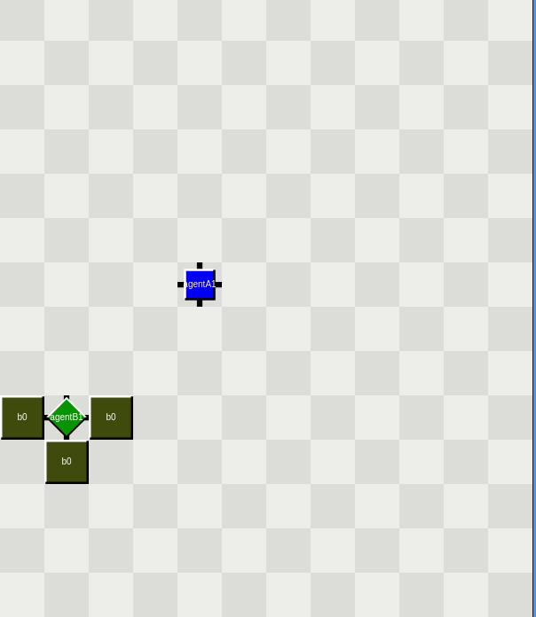
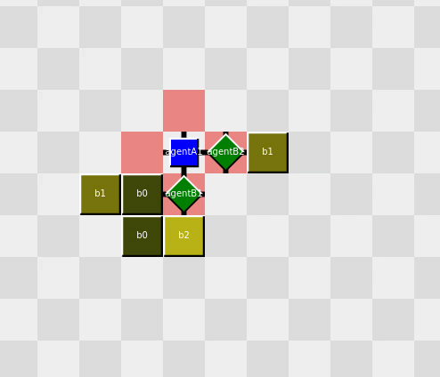
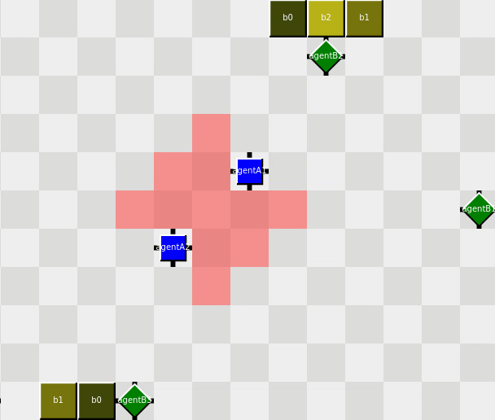

<!-- EXAMPLES -->
# Showcase
Examples of possible integrations between machine learning and BDI
## Bomber
| Disabling static enemy  | Disabling moving enemy | Adjusting enemy pathing
| ------------- | ------------- |-------------
|   |   | 

## Blocker
| 1 blocker blocking 2 builders  | 2 blockers blocking 3 builders 
| ------------- | ------------- 
|   |   